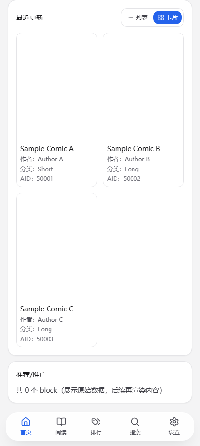
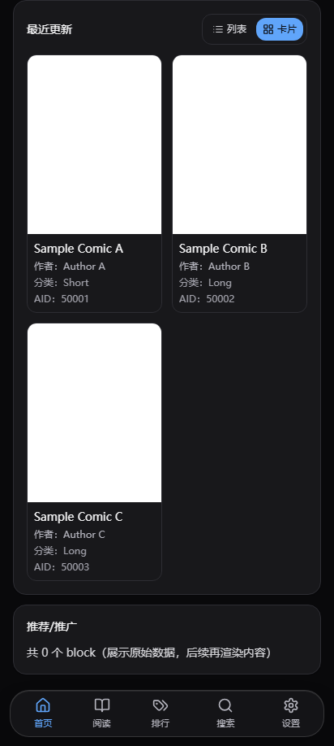
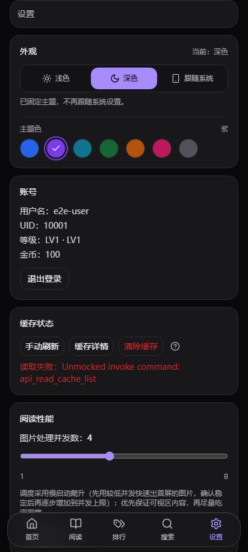
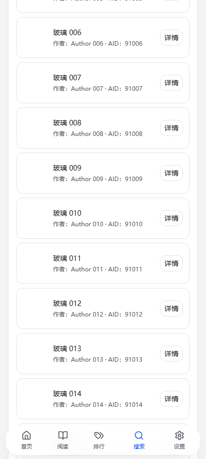
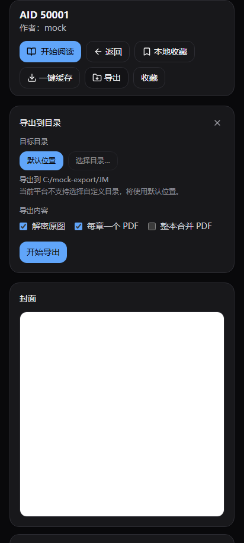
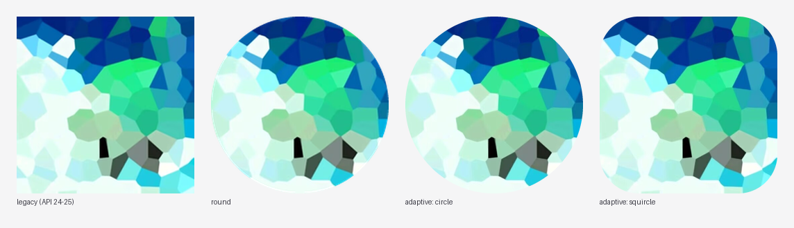

# jm-tauri 客户端 🧭

> ### 本仓库是什么
>
> 这是 **[alexsunxl/jm-tauri](https://github.com/alexsunxl/jm-tauri)** 的**修改版**（基于上游 `v0.1.25` 源码）。
> 上游采用 **GPL-3.0** 协议，版权归上游作者与贡献者所有；本仓库的改动同样以 **GPL-3.0** 发布，
> 完整协议见 [`LICENSE`](./LICENSE)。**想要原版请直接去上游仓库**。

## 本仓库的改动

| 批次 | 内容 | 文档 |
| --- | --- | --- |
| 1 | 暗色模式（浅色 / 深色 / 跟随系统），全站颜色改为变量驱动 | [`docs/01-darkmode.md`](docs/01-darkmode.md) |
| 2 | 搜索增强：可指定每次加载条数、触底自动翻页、切走再回来保留结果与滚动位置 | [`docs/02-search.md`](docs/02-search.md) |
| 3 | 圆角体系、底部导航与浮层液态玻璃、7 套主题色、导出到指定目录 / PDF、更换应用图标 | [`docs/03-ui-export-and-icon.md`](docs/03-ui-export-and-icon.md) |
| 4 | 真机反馈修复：底部导航「阅读」菜单被裁剪、导出图片/PDF 全部失败、导出图片错位条带 | [`docs/03-ui-export-and-icon.md`](docs/03-ui-export-and-icon.md) |

### 界面预览

| 浅色 | 深色 |
| --- | --- |
|  |  |

| 主题色切换 | 液态玻璃底栏 |
| --- | --- |
|  |  |

| 导出面板 | 图标 |
| --- | --- |
|  |  |

### 导出图片错位的修复（第 4 批）

禁漫的每张图在服务器上是「横向切成 N 条、倒序存放」的，N 由 `md5(章节ID + 文件名)` 决定，且**文件名不含扩展名**。
导出路径当时用了带扩展名的文件名去算 N，导致大部分页条数算错、重新拼接后成为错位条带

## 下载与安装

预编译 APK 见本仓库的 **[Releases](../../releases)** 页面：

| 文件 | ABI | sha256 |
| --- | --- | --- |
| `jm-0.1.25-darkmode-universal.apk` | arm64-v8a / armeabi-v7a / x86 / x86_64 | `127d243731a95bc0a4f0788f05e2962c13fb57e81a0508b06d3c36e1f98175a6` |
| `jm-0.1.25-darkmode-arm64.apk` | arm64-v8a | `fc5bf41f252e904aa4913f5e2160bc0deed31c7800108cfef84b3fa391ac2a4a` |

- 包名 `com.aa.jm`，版本名 `0.1.25+darkmode`，`versionCode` 高于原版，**可直接覆盖安装**，登录态 / 收藏 / 阅读进度不丢。
- ⚠️ 本仓库**不包含签名密钥**：`jm/jm-release.keystore` 与 `jm/src-tauri/keystore.properties` 已加入 `.gitignore`。
  自己构建时需要一个**同包名**的签名密钥，否则无法覆盖安装官方版（卸载重装会丢数据）。
- 构建方式见 [`docs/04-build-and-release.md`](docs/04-build-and-release.md)。

---

以下为上游 README 原文

#  jm-tauri 客户端 🧭

- 🧩 Tauri + React 客户端支持 Windows / macOS / Linux / Android(apk)
- 🛠️ 技术栈：TypeScript、React、Vite、Tailwind CSS、Tauri (Rust)
- ⚠️ 仅供技术研究，请勿用于其他用途
- 💬 如有问题欢迎提 ISSUE
- ✅ 欢迎下载体验：[release](https://github.com/alexsunxl/jm-tauri/releases/latest)

## 功能概览 ✨
- 登录/搜索/详情/阅读
- 详情页评论（列表/回复/安全渲染）
- 在线收藏 / 本地收藏 / 浏览记录（含本地阅读记录补充）
- 分类与排行
- 阅读进度记录、继续阅读、列表进度联动
- 离线阅读缓存：浏览自动缓存图片，详情页一键缓存封面、详情/章节数据与图片，断网或登录态失效时可打开已缓存详情并继续阅读
- 缓存管理：总量/文件数/漫画数统计、按漫画查看与删除、阈值清理（图片与离线详情数据一并清理）
- 代理设置与 API 域名管理（含测速）
- 下载与本地缓存（按平台写入可写目录）

## why jm-tauri（亮点） 📌
### 性能和体验
- 基于rust和webview，性能好到爆炸
- 多话连读：读到章节末尾后上拉即可进入下一话，无需返回目录切换章节
- 阅读图片调度支持“可视区优先 + 慢启动爬升（先低并发快速出首屏的图片，再逐步加速到并发上限）”：先保首屏/可视内容，再自动拉满到并发上限，弱网和高速网络下都更稳更快
### 阅读进度
- 自动记录到章节/页
- 列表内可直接继续阅读
- 支持本地收藏与历史记录的进度联动

## 开发文档 📚
- 图片超分TODO：`doc/sr.md`
- APK/JDK 说明：`doc/android-apk.md`
- 本地运行与构建：`doc/dev.md`

## 参考项目 🔗
- JMComic-Crawler-Python：`https://github.com/hect0x7/JMComic-Crawler-Python`
- JMComic-Api-Java：`https://github.com/JUKOMU/JMComic-Api-Java`
- JMComic-qt：`https://github.com/tonquer/JMComic-qt`
